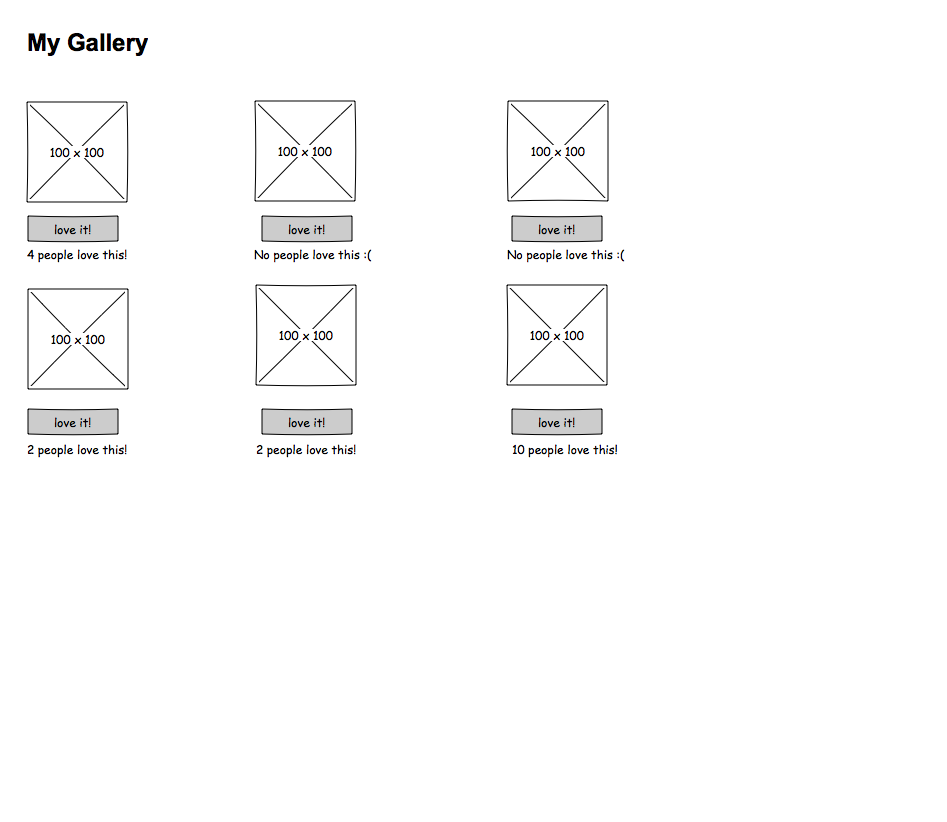
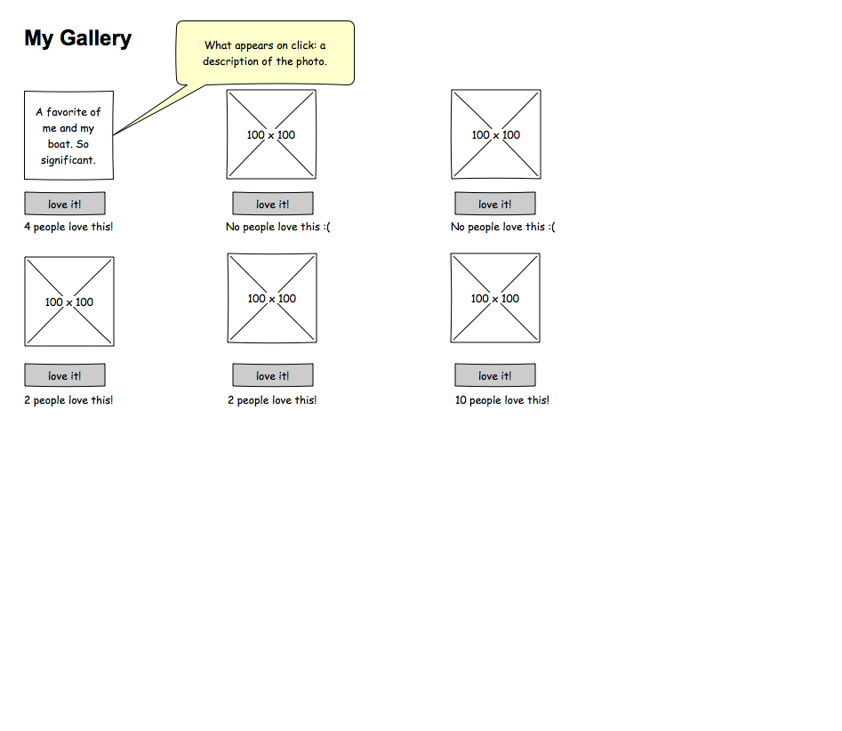

# Weekend Challenge 4

We're switching up our client-side this weekend with Angular! Our focus will be on getting comfortable with what Angular can do for us, so most of our effort will be on client-side JavaScript and, hopefully, experimenting with CSS.

## The Gallery of My Life

This weekend's application will be a gallery of 6 or more pictures of significance to you. When someone clicks on a picture, they should see a brief synopsis of why you chose to display that photo. Users can also heart/thumbs up/favorite your photo as many times as they want; you'll need to keep track of how many times it was clicked.

## Technologies

* Node/Express - to serve your files
* Angular - client-side logic
* CSS - flex your style muscles
* Heroku - to make your site available to the world (Pro Mode)

## Wireframes

This is just an idea of what should be on the page. Style it and make it your own with CSS!

### Gallery - Initial Page Load

### Gallery - On Image Click

## Hints

* Explore built-in Angular functionality like `ng-click`, `ng-src`, `ng-show`, `ng-hide`, `ng-if`.
* Use arrays and objects to store your data on the **server**.

## Hard Mode

Create a form that will take comments for each of your photos. Display the comments when a "Show Comments" button is clicked.

## Pro Mode

Use Angular's `$http` service to store your data on the server instead of the client. Try and deploy your site to Heroku. This is new, follow [this guide](https://docs.google.com/document/d/1Fz9O6Zv86eM-NARZwQKgVsX_5WNFYMop3TzI9g7LaWc/edit?usp=sharing) for some tips.

~~~~~~~Live Solve~~~~~~

Branches
step 00: node/expres
step01: index with scripts & CSS sourced ->ng-app, ng-controller
step02: returning an array of objects -> $http
step03: displaying on DOM -> ng-repeat
step04: image toggle
step05: hooray system
step06: styling pass

step00
1. git init
2. git ignore
3. npm init
4. canopus_wknd4_love_solve
5. npm install body-parser express --save
6. "start": "node server.js"
7. make server.js
8. set up public folder
9. set up modules folder
    routes
        index.js
        sentimentals.js
10. set up vendors folder
11. spin up server -> require express, var app, require body-parser, port, app.listen
12. under port, app.use(body-parser)
    app.use(express.static('public'))
13. index.html boilerplate and a tite and h1
14. vendors -> right click, reveal in finder, copy over angular
15. source in scripts-> vendors/angular.min.js
                        ->scripts/client.js
16. index.js router-> var express = require('express'), var router, require path, router.get('/') res.sendFile(path.resolve(path)), module.exports,
17. require index in server var index = require('./modules/routes/index);
18. after bodyParser.json, app.use()
step01
client.js
1. myapp.controller with $http ->client.js
2. index.html -> section ng-controller -> nested paragraph tag
step02
1. sentimentals.js -> express and router, sentiments array = [], router.get ('/'), res.send('bark'), module.exports server.js ->var sentimentsals = require, app.use('/sentimentals');
 -> check for handshake
2. client.js -> myapp.controller -> vm.getSentimentals();, $http->method url .then with annonymous function (above vm.getSentimentals)
3. change send to array instad of object (?)
4. get an array back from server -> put objects in
5. sentimentals.push(image: test1, synopsis: test1, hoorays: 0);
6. getting "dummy" data from server
step03
git checkout -b 'step 02', git branch, git checkout -b 'step02a', git branch
1. images
2. can put in image url, http://localhost:3000.......
3. next steps=client.js-> ng-repeat thru response.data 
4. vm.sentimentals = response.data -> under console.log in .then function
5. index.html-> in p under section-> ng-repeat='sentimental in SC.sentimentals'>{{sentimental}}

6. under section, before paragraph, build a test img src in a div, along with p synopsis text and p hoorays with a hooray button
step04
1. ng-hide and ng-show -> they both check a single boolean (mutually exclusive)

capture button click, get id, send to server, have server increment #of hoorays, send back 200, run GET again

steps (step05)
1. ng-click works, make sure
2. $index
3. server route
4. $http handshake is working
5. increment appropriate hooray

step05
1. put ng-click on hooray button-> <'SC.hoorayForThis( $index )'>
2. client.js -> vm.hoorayForThis=function( index) {console.log('in hooray:', index)}-> (under getSentimentals) (1,2)

Q. stuck? Make a list of steps

3. sentimentals route -> router.put('/', function(req, res){
    console.log('in sentimentals put:', req.body);
    re.send('meow')
})
4. client.js-> vm.hoorayForThis under console.log-> $http({
    method: 'PUT',
    url: '/sentimentals',
    data: {index: index}
}).then (function)(response){
    console.log('back from put with:, response,) ->whack sentimentals.js 
}
-> will be getting 'meow' upon hooray click
5. router.put-> sentimentals[req.body.index].hoorays++;->make meow into 200-> run vm.getSentimentals(client.js)
step06
1. css file
2. .sentimental{
    width: 31%
    background-color: b4da55;
    float: left;
    padding: 6px;
    margin: 5px;
    text-align: center;
    border-style: solid;
    border-color: black;
    border-radius: 8px;
}
3. make a sentimentalImage class on img
4. width: 85%;
    border: 6px;

